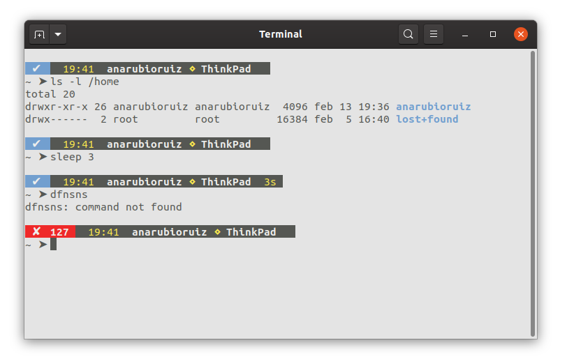

# My bash prompt design




1. Clone this repository.
2. Create a link to the `.bash-prompt` file in your home directory:
```
ln -s <repository_path>/.bash-prompt ~
```
2. Add at the end of your `.bashrc` (located also in your home dir) the following:
```
source /home/$(whoami)/.bash-prompt
PROMPT_COMMAND="set-prompt ; $PROMPT_COMMAND"
```
**DONE!**

### Recommendations
- Background color: #E4E4E4
- Text color: #555753

## References
1. https://gist.github.com/davidvilla/4541c13f7a53f65c04edc8893d9a8f3f
2. https://martin.ankerl.com/2016/11/04/linux-bash-prompt/
3. https://misc.flogisoft.com/bash/tip_colors_and_formatting
