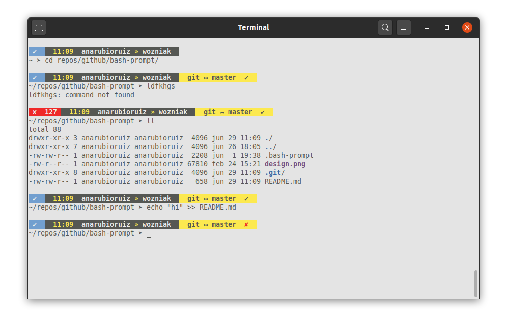

# My bash prompt design



1. Clone this repository.
2. Create a link to the `.bash-prompt` file in your home directory:
```
ln -s <repository_path>/.bash-prompt ~
```
2. Add at the end of your `.bashrc` (located also in your home dir) the following:
```
source .bash-prompt
PROMPT_COMMAND="set-prompt ; $PROMPT_COMMAND"
```
**DONE!**
